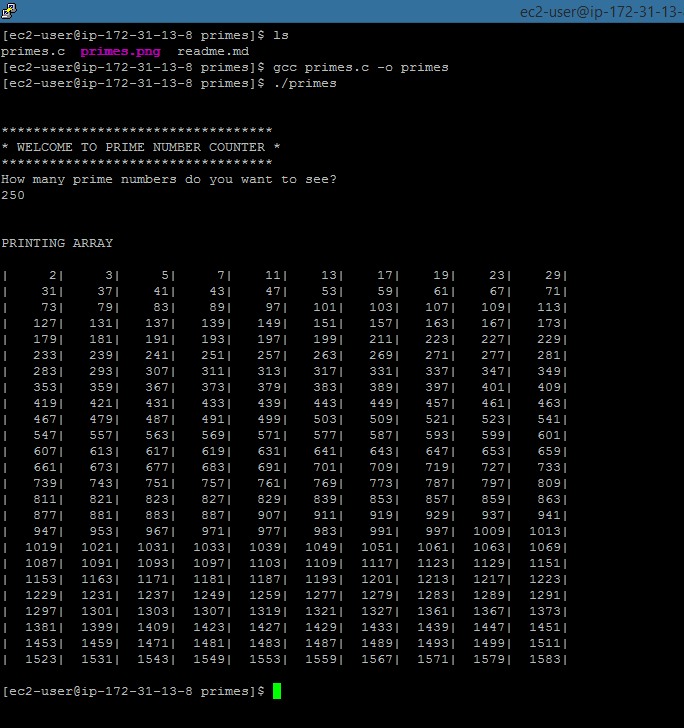

-----------------------------------------------------------------------------------------------
## Prime Number Generator in C
#### Justin J
-----------------------------------------------------------------------------------------------

- program prompts user to enter total number of prime numbers to print
- outputs array to console
- program relies on fact that every prime number is either 1 more or 1 less than multiple of 6

